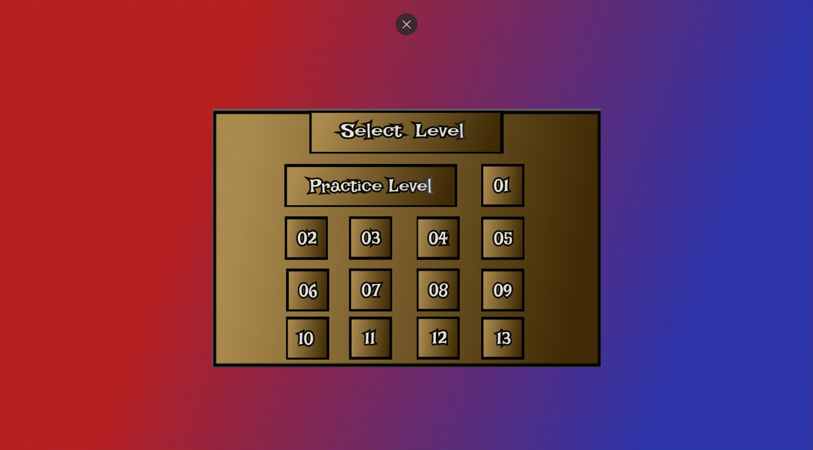
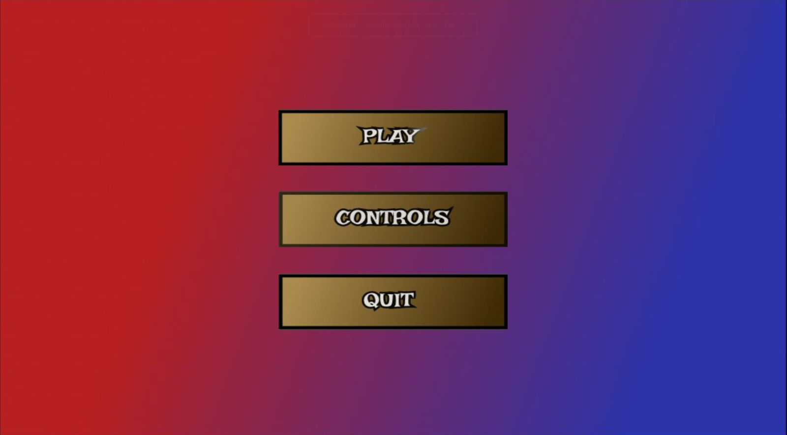
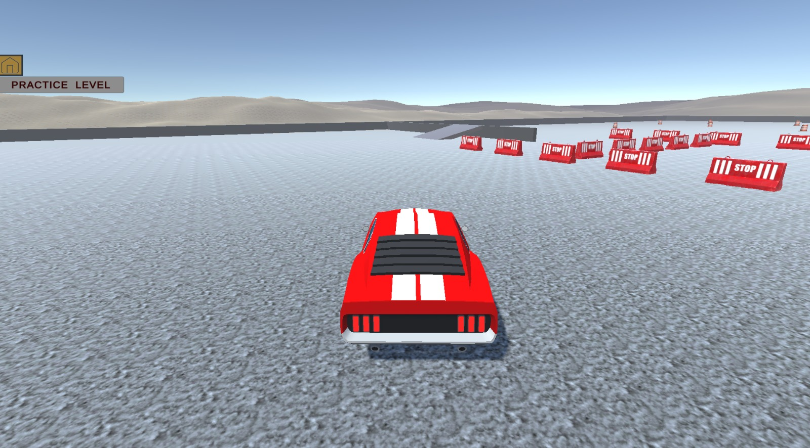
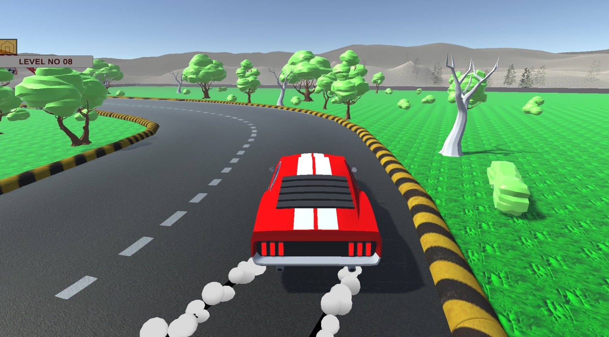
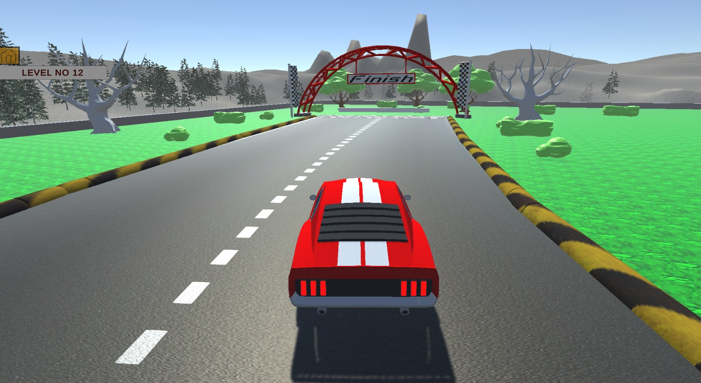

# Drifting Mania

A 3D drifting game developed in Unity as a personal learning project focused on game development, level design, and gameplay mechanics.

## Overview

Drifting Mania is a level-based driving game where the player must control a drifting car, stay within the track boundaries, and reach the finish line successfully. Touching the boundaries results in mission failure.

The game contains multiple levels(14) with increasing difficulty and different track layouts.

## Features

- 14 playable levels
- Main menu system
- Drift-based driving mechanics
- Boundary collision fail system
- Finish line objectives
- Progressive level design
- 3D gameplay environment

## Technologies Used

- Unity
- C#
- Visual Studio

## Screenshots

### Main Menu

### Opening Screen

### Practice Level

### Level 8

### Level 12

## Gameplay Video

Gameplay footage is available in the repository:

## What I Learned

- Unity Game Engine fundamentals
- Scene management
- Level design
- Collision detection
- Player movement systems
- Testing and debugging
- Version control using Git and GitHub

## Author

Muhammad Ibrahim

GitHub: https://github.com/mibrahim999
LinkedIn: https://linkedin.com/in/muhammad-ibrahim0981122
